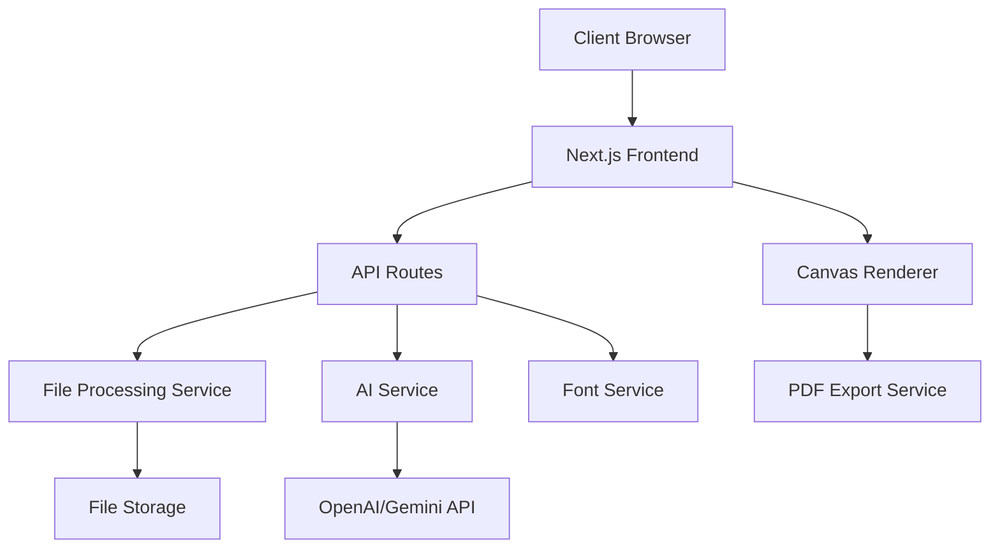

# Design Document

## Overview

The Handwritten Assignment Generator is a Next.js 14+ application built with TypeScript that transforms digital assignment content into realistic handwritten documents. The application uses a modern React-based architecture with server-side rendering capabilities, AI integration for content generation, and canvas-based rendering for handwritten output.

### Technology Stack

- **Framework**: Next.js 14+ (App Router)
- **Language**: TypeScript
- **UI Components**: React 18+, Tailwind CSS
- **AI Integration**: OpenAI API (GPT-4) or Google Gemini API
- **File Processing**: pdf-parse, mammoth (for DOCX), tesseract.js (for OCR)
- **Canvas Rendering**: HTML5 Canvas API, fabric.js
- **Font Management**: Custom web fonts via @font-face
- **PDF Generation**: jsPDF with custom font support
- **State Management**: React Context API + useReducer
- **File Upload**: react-dropzone

## Architecture

### High-Level Architecture



### Application Structure

```
handwritten-assignment-generator/
├── src/
│   ├── app/
│   │   ├── layout.tsx
│   │   ├── page.tsx (Dashboard)
│   │   └── api/
│   │       ├── upload/route.ts
│   │       ├── generate/route.ts
│   │       └── fonts/route.ts
│   ├── components/
│   │   ├── Dashboard/
│   │   │   ├── UploadSection.tsx
│   │   │   ├── PromptInput.tsx
│   │   │   └── PreviewPanel.tsx
│   │   ├── Canvas/
│   │   │   ├── NotebookCanvas.tsx
│   │   │   ├── PageRenderer.tsx
│   │   │   └── HandwritingRenderer.tsx
│   │   ├── Editor/
│   │   │   ├── TextEditor.tsx
│   │   │   └── RealTimeSync.tsx
│   │   └── Controls/
│   │       ├── FontSelector.tsx
│   │       ├── PageStyleSelector.tsx
│   │       ├── ColorPicker.tsx
│   │       └── ExportButton.tsx
│   ├── lib/
│   │   ├── services/
│   │   │   ├── fileProcessor.ts
│   │   │   ├── aiService.ts
│   │   │   ├── fontService.ts
│   │   │   └── pdfExporter.ts
│   │   ├── utils/
│   │   │   ├── layoutEngine.ts
│   │   │   ├── textMeasurement.ts
│   │   │   └── pageCalculator.ts
│   │   └── types/
│   │       ├── assignment.ts
│   │       ├── canvas.ts
│   │       └── fonts.ts
│   ├── styles/
│   │   └── globals.css
│   └── public/
│       └── fonts/
│           └── handwritten/ (100+ font files)
```

## Components and Interfaces

### 1. File Upload and Processing

#### UploadSection Component
```typescript
interface UploadSectionProps {
  onFileUpload: (content: ExtractedContent) => void;
  acceptedFormats: string[];
}

interface ExtractedContent {
  text: string;
  metadata: {
    fileName: string;
    fileType: string;
    pageCount?: number;
  };
}
```

**Responsibilities:**
- Accept drag-and-drop or click-to-upload files
- Validate file types (PDF, DOCX, PNG, JPG, JPEG, TXT)
- Display upload progress
- Trigger file processing via API route

#### File Processing Service
```typescript
class FileProcessor {
  async processPDF(file: File): Promise<string>;
  async processDOCX(file: File): Promise<string>;
  async processImage(file: File): Promise<string>; // OCR
  async processText(file: File): Promise<string>;
}
```

**Implementation Details:**
- PDF: Use `pdf-parse` to extract text
- DOCX: Use `mammoth` to convert to plain text
- Images: Use `tesseract.js` for OCR
- Text: Direct read with encoding detection

### 2. AI Content Generation

#### PromptInput Component
```typescript
interface PromptInputProps {
  onSubmit: (prompt: string, context: string) => void;
  uploadedContent: string;
  isGenerating: boolean;
}
```

#### AI Service
```typescript
interface AIServiceConfig {
  provider: 'openai' | 'gemini';
  apiKey: string;
  model: string;
}

interface GenerationRequest {
  prompt: string;
  context: string;
  wordCount?: number;
  questionCount?: number;
}

interface GenerationResponse {
  answers: Answer[];
  totalWords: number;
}

interface Answer {
  questionNumber: number;
  content: string;
  wordCount: number;
}

class AIService {
  async generateAnswers(request: GenerationRequest): Promise<GenerationResponse>;
  private parsePrompt(prompt: string): ParsedPrompt;
  private formatResponse(rawResponse: string): Answer[];
}
```

**Implementation Strategy:**
- Use structured prompts to ensure consistent answer formatting
- Parse user prompts to extract word count and question requirements
- Split responses into individual answers with metadata
- Implement retry logic for API failures

### 3. Preview and Editing System

#### PreviewPanel Component
```typescript
interface PreviewPanelProps {
  textContent: Answer[];
  handwrittenContent: CanvasPage[];
  onTextEdit: (answerId: number, newContent: string) => void;
  syncScroll: boolean;
}
```

#### TextEditor Component
```typescript
interface TextEditorProps {
  answers: Answer[];
  onEdit: (answerId: number, content: string) => void;
  readOnly: boolean;
}
```

**Features:**
- Split-pane layout with synchronized scrolling
- Contenteditable divs for text editing
- Debounced updates to prevent excessive re-renders
- Visual indicators for edited content

### 4. Handwriting Rendering System

#### NotebookCanvas Component
```typescript
interface NotebookCanvasProps {
  pages: CanvasPage[];
  pageStyle: PageStyle;
  font: HandwrittenFont;
  textColor: string;
  onPageRender: (pageIndex: number) => void;
}

interface CanvasPage {
  pageNumber: number;
  lines: CanvasLine[];
  style: PageStyle;
}

interface CanvasLine {
  text: string;
  x: number;
  y: number;
  fontSize: number;
}

type PageStyle = 'ruled' | 'unruled' | 'lined';

interface HandwrittenFont {
  id: string;
  name: string;
  family: string;
  url: string;
  preview: string;
}
```

#### HandwritingRenderer Service
```typescript
class HandwritingRenderer {
  private canvas: HTMLCanvasElement;
  private ctx: CanvasRenderingContext2D;
  
  async renderText(
    text: string,
    font: HandwrittenFont,
    color: string,
    pageStyle: PageStyle
  ): Promise<CanvasPage[]>;
  
  private drawPageBackground(style: PageStyle): void;
  private measureText(text: string, font: string): TextMetrics;
  private wrapText(text: string, maxWidth: number): string[];
}
```

**Rendering Strategy:**
- Use HTML5 Canvas for high-performance rendering
- Load custom fonts dynamically using FontFace API
- Implement text wrapping with word boundary detection
- Add subtle variations to character positioning for natural look
- Cache rendered pages for performance

### 5. Layout Engine

#### Layout Engine Service
```typescript
interface LayoutConfig {
  pageWidth: number;
  pageHeight: number;
  marginTop: number;
  marginBottom: number;
  marginLeft: number;
  marginRight: number;
  lineHeight: number;
  lineSpacing: number;
}

interface LayoutResult {
  pages: CanvasPage[];
  totalPages: number;
}

class LayoutEngine {
  private config: LayoutConfig;
  
  calculateLayout(answers: Answer[], font: HandwrittenFont): LayoutResult;
  private splitIntoLines(text: string, maxWidth: number): string[];
  private distributeAcrossPages(lines: string[]): CanvasPage[];
  private addQuestionSpacing(pages: CanvasPage[], answers: Answer[]): CanvasPage[];
}
```

**Layout Algorithm:**
1. Measure text width using canvas measureText()
2. Split text into lines that fit within page margins
3. Calculate line positions based on page style (ruled/unruled/lined)
4. Add one blank line between answers
5. Create new pages when content exceeds page height
6. Maintain consistent spacing and alignment

### 6. Font Management

#### FontSelector Component
```typescript
interface FontSelectorProps {
  fonts: HandwrittenFont[];
  selectedFont: HandwrittenFont;
  onFontChange: (font: HandwrittenFont) => void;
}
```

#### Font Service
```typescript
class FontService {
  async loadFonts(): Promise<HandwrittenFont[]>;
  async loadFont(font: HandwrittenFont): Promise<void>;
  getFontPreview(font: HandwrittenFont): string;
  private validateFont(font: HandwrittenFont): boolean;
}
```

**Font Management Strategy:**
- Store 100+ handwritten fonts in `/public/fonts/handwritten/`
- Use @font-face declarations for web font loading
- Implement lazy loading for fonts (load on selection)
- Provide thumbnail previews for font selection
- Support TTF, OTF, and WOFF2 formats

**Font Sources:**
- Google Fonts (handwriting category, filtered)
- DaFont (handwriting section)
- FontSquirrel (handwriting fonts)
- Custom curated collection

### 7. Page Style System

#### PageStyleSelector Component
```typescript
interface PageStyleSelectorProps {
  selectedStyle: PageStyle;
  onStyleChange: (style: PageStyle) => void;
}
```

**Page Style Implementations:**

**Ruled Pages:**
- Horizontal lines spaced 8-10mm apart
- Optional margin line on left
- Light gray or blue line color (#E0E0E0 or #D0E0F0)

**Unruled Pages:**
- Plain white or cream background
- No lines or guides
- Margins indicated by subtle borders

**Lined Pages:**
- Horizontal lines with left margin line
- Red or pink margin line
- Standard notebook appearance

### 8. Color System

#### ColorPicker Component
```typescript
interface ColorPickerProps {
  selectedColor: string;
  colors: ColorOption[];
  onColorChange: (color: string) => void;
}

interface ColorOption {
  name: string;
  hex: string;
  preview: string;
}
```

**Predefined Colors:**
- Black (#000000)
- Blue (#0000FF, #1E3A8A)
- Dark Blue (#000080)
- Red (#FF0000, #DC2626)
- Green (#008000, #16A34A)
- Purple (#800080, #9333EA)
- Brown (#8B4513, #92400E)
- Gray (#808080, #6B7280)

### 9. Export System

#### ExportButton Component
```typescript
interface ExportButtonProps {
  pages: CanvasPage[];
  fileName: string;
  onExport: () => void;
}
```

#### PDF Exporter Service
```typescript
interface ExportOptions {
  format: 'a4' | 'letter';
  orientation: 'portrait' | 'landscape';
  quality: number; // DPI
}

class PDFExporter {
  async exportToPDF(
    pages: CanvasPage[],
    options: ExportOptions
  ): Promise<Blob>;
  
  private canvasToImage(canvas: HTMLCanvasElement): string;
  private addPageToPDF(pdf: jsPDF, imageData: string): void;
}
```

**Export Process:**
1. Render each page to canvas
2. Convert canvas to high-resolution image (300 DPI)
3. Create PDF document using jsPDF
4. Add each page image to PDF
5. Embed custom fonts in PDF
6. Generate and download PDF blob

## Data Models

### Application State
```typescript
interface AppState {
  uploadedContent: ExtractedContent | null;
  prompt: string;
  generatedAnswers: Answer[];
  editedAnswers: Map<number, string>;
  selectedFont: HandwrittenFont;
  selectedPageStyle: PageStyle;
  selectedColor: string;
  canvasPages: CanvasPage[];
  isGenerating: boolean;
  isRendering: boolean;
}

type AppAction =
  | { type: 'SET_UPLOADED_CONTENT'; payload: ExtractedContent }
  | { type: 'SET_PROMPT'; payload: string }
  | { type: 'SET_GENERATED_ANSWERS'; payload: Answer[] }
  | { type: 'EDIT_ANSWER'; payload: { id: number; content: string } }
  | { type: 'SET_FONT'; payload: HandwrittenFont }
  | { type: 'SET_PAGE_STYLE'; payload: PageStyle }
  | { type: 'SET_COLOR'; payload: string }
  | { type: 'SET_CANVAS_PAGES'; payload: CanvasPage[] }
  | { type: 'SET_GENERATING'; payload: boolean }
  | { type: 'SET_RENDERING'; payload: boolean };
```

### Database Schema (Optional - for user accounts)
```typescript
// If implementing user authentication and history
interface User {
  id: string;
  email: string;
  createdAt: Date;
}

interface Assignment {
  id: string;
  userId: string;
  title: string;
  uploadedFile: string;
  prompt: string;
  generatedContent: Answer[];
  settings: {
    font: string;
    pageStyle: PageStyle;
    color: string;
  };
  createdAt: Date;
  updatedAt: Date;
}
```

## Error Handling

### Error Types
```typescript
class FileProcessingError extends Error {
  constructor(message: string, public fileType: string) {
    super(message);
  }
}

class AIGenerationError extends Error {
  constructor(message: string, public retryable: boolean) {
    super(message);
  }
}

class RenderingError extends Error {
  constructor(message: string, public pageNumber: number) {
    super(message);
  }
}

class ExportError extends Error {
  constructor(message: string, public stage: string) {
    super(message);
  }
}
```

### Error Handling Strategy

**File Upload Errors:**
- Invalid file type: Show user-friendly message with accepted formats
- File too large: Suggest compression or splitting
- Corrupted file: Provide alternative upload methods
- OCR failure: Allow manual text input

**AI Generation Errors:**
- API rate limit: Implement exponential backoff
- Invalid API key: Prompt for configuration
- Network timeout: Retry with user notification
- Invalid response: Parse and sanitize output

**Rendering Errors:**
- Font loading failure: Fall back to default font
- Canvas context loss: Reinitialize canvas
- Memory issues: Implement pagination for large documents

**Export Errors:**
- PDF generation failure: Offer alternative formats (images)
- Download blocked: Provide manual download link
- Large file size: Compress or split into multiple files

### User Feedback
```typescript
interface Notification {
  type: 'success' | 'error' | 'warning' | 'info';
  message: string;
  duration?: number;
  action?: {
    label: string;
    onClick: () => void;
  };
}
```

## Testing Strategy

### Unit Tests
- File processing functions (PDF, DOCX, image extraction)
- Layout engine calculations
- Text measurement and wrapping
- Font loading and validation
- Color conversion utilities

### Integration Tests
- File upload to AI generation flow
- Text editing to canvas re-rendering
- Font selection to display update
- Complete export workflow

### End-to-End Tests
- Upload file → Generate → Edit → Export workflow
- Multiple file format uploads
- Font and style changes
- Real-time preview synchronization

### Performance Tests
- Large document rendering (50+ pages)
- Font loading time
- Canvas rendering performance
- PDF export speed
- Memory usage monitoring

### Test Tools
- Jest for unit tests
- React Testing Library for component tests
- Playwright for E2E tests
- Lighthouse for performance audits

## Performance Optimizations

### 1. Lazy Loading
- Load fonts on demand
- Virtualize canvas pages (render only visible pages)
- Code splitting for heavy components

### 2. Caching
- Cache rendered canvas pages
- Memoize layout calculations
- Cache font metrics

### 3. Debouncing
- Debounce text edits (300ms)
- Throttle scroll events (16ms)
- Debounce canvas re-renders

### 4. Web Workers
- Process large files in background
- Perform layout calculations off main thread
- Generate PDF in worker

### 5. Progressive Enhancement
- Show text preview immediately
- Render handwritten version progressively
- Load high-quality fonts after initial render

## Security Considerations

### 1. File Upload Security
- Validate file types on client and server
- Limit file size (max 50MB)
- Scan for malicious content
- Sanitize extracted text

### 2. API Security
- Store API keys in environment variables
- Implement rate limiting
- Validate and sanitize user prompts
- Use HTTPS for all API calls

### 3. Content Security
- Sanitize user input to prevent XSS
- Implement CORS policies
- Use Content Security Policy headers
- Validate generated content

### 4. Data Privacy
- Don't store uploaded files permanently (unless user account feature)
- Clear sensitive data from memory
- Implement secure session management
- Comply with data protection regulations

## Deployment Strategy

### Development Environment
```bash
npm run dev
```

### Production Build
```bash
npm run build
npm run start
```

### Environment Variables
```
NEXT_PUBLIC_AI_PROVIDER=openai
OPENAI_API_KEY=your_key_here
GEMINI_API_KEY=your_key_here
NEXT_PUBLIC_MAX_FILE_SIZE=52428800
NEXT_PUBLIC_FONT_CDN_URL=https://your-cdn.com/fonts
```

### Hosting Options
- **Vercel**: Optimal for Next.js (recommended)
- **Netlify**: Good alternative with edge functions
- **AWS Amplify**: For AWS ecosystem integration
- **Self-hosted**: Docker container on VPS

### CDN Strategy
- Host fonts on CDN for faster loading
- Cache static assets
- Use edge functions for API routes

## Future Enhancements

1. **User Accounts**: Save and manage multiple assignments
2. **Collaboration**: Share assignments with peers
3. **Templates**: Pre-defined assignment templates
4. **Handwriting Variations**: Add natural variations to handwriting
5. **Mobile App**: React Native version
6. **Batch Processing**: Process multiple assignments at once
7. **Custom Fonts**: Allow users to upload their own handwriting fonts
8. **Advanced Editing**: Rich text editor with formatting options
9. **Cloud Storage**: Integration with Google Drive, Dropbox
10. **Analytics**: Track usage and popular features
